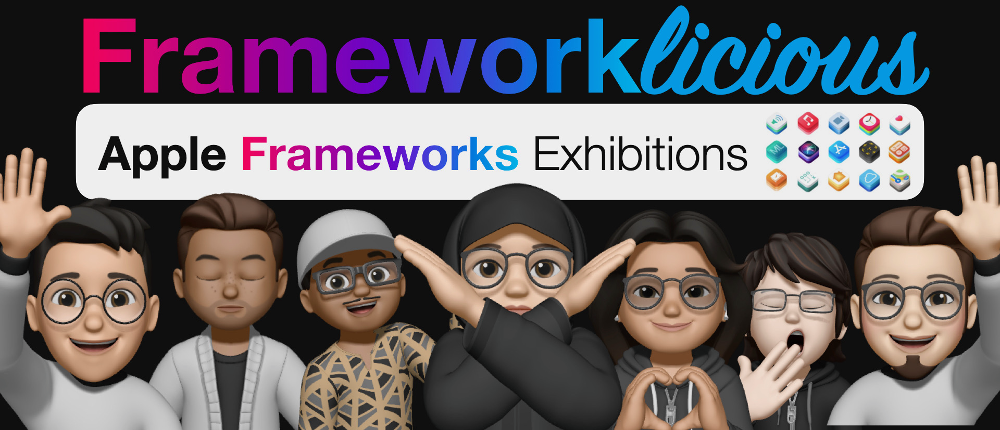

# Day 1

<a href="HealthKit"> 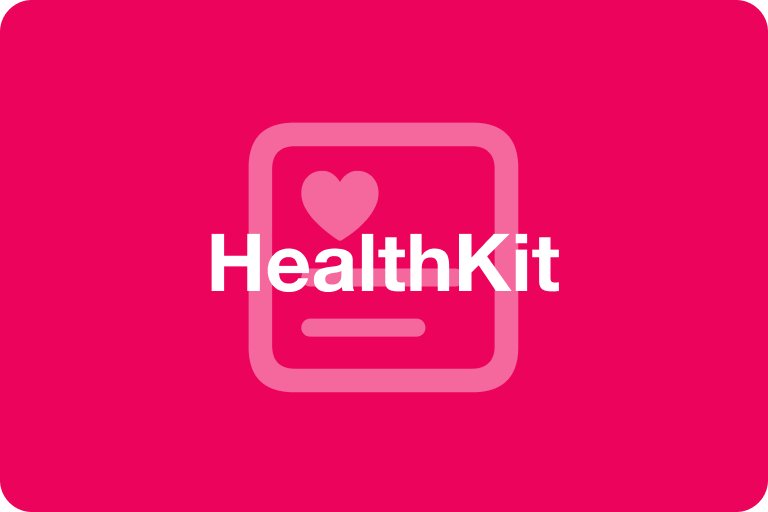 </a> 
 
 
<a href="Apple%20Watch"> 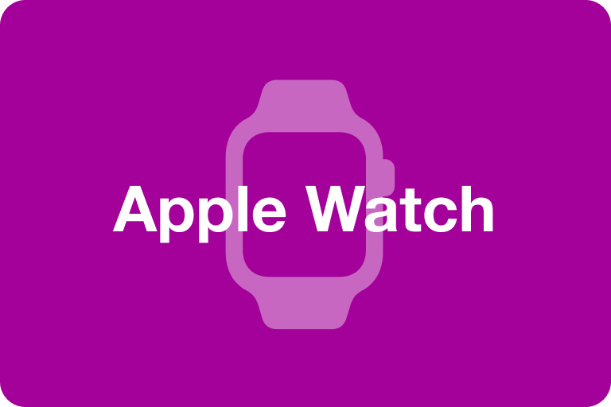 </a> 
<a href="Multipeer%20Connectivity"> 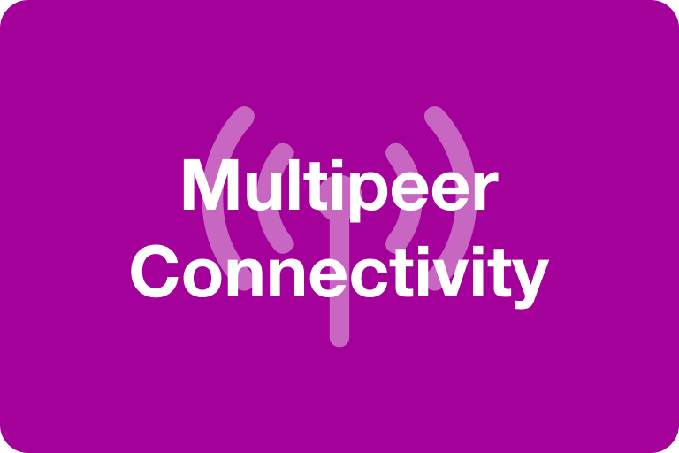 </a> 
<a href="SharePlay"> 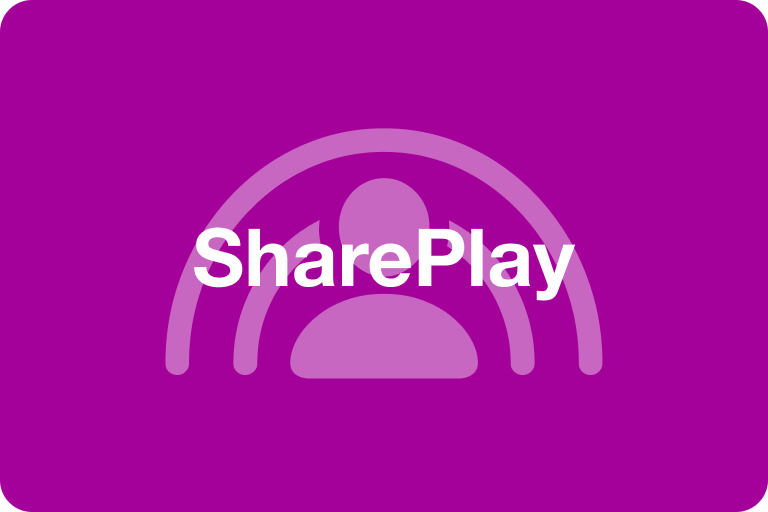 </a> 
<a href="Haptics"> 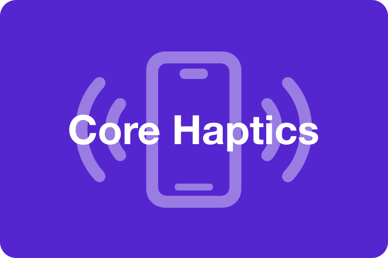 </a> 
<a href="SwiftUI%20Animations"> 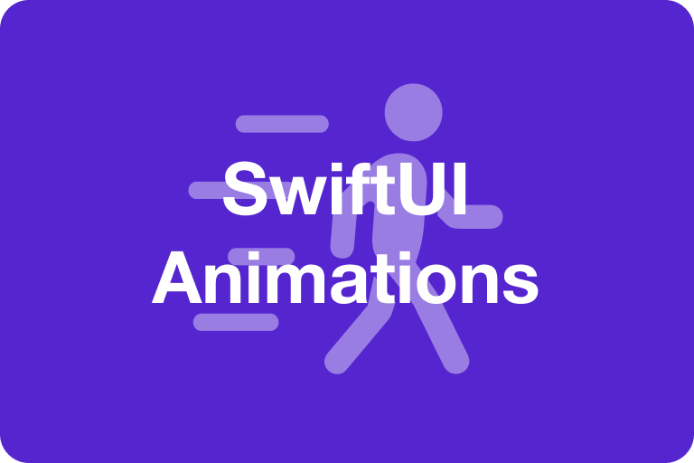 </a> 
<a href="Augmented%20Reality"> 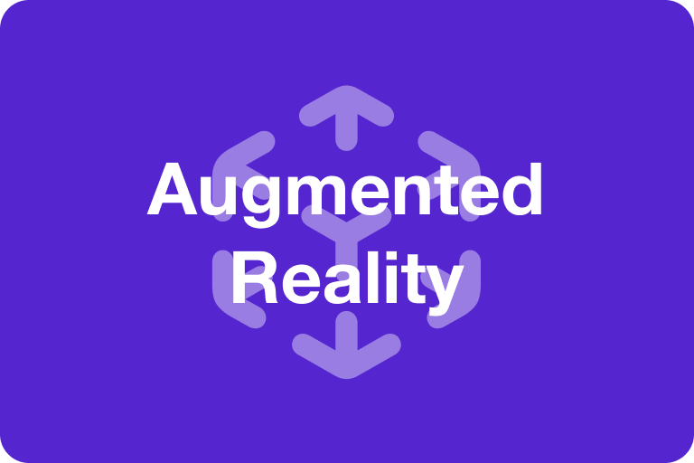 </a> 

# Day 2
<a href="Siri"> 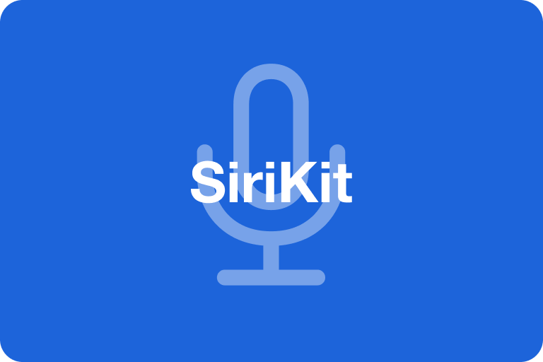 </a> 
 
<a href="Location"> 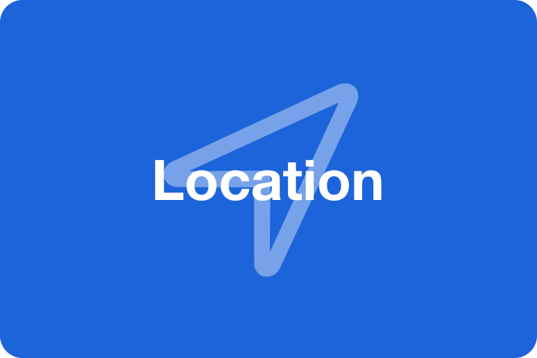 </a> 
<a href="Live%20Activity"> 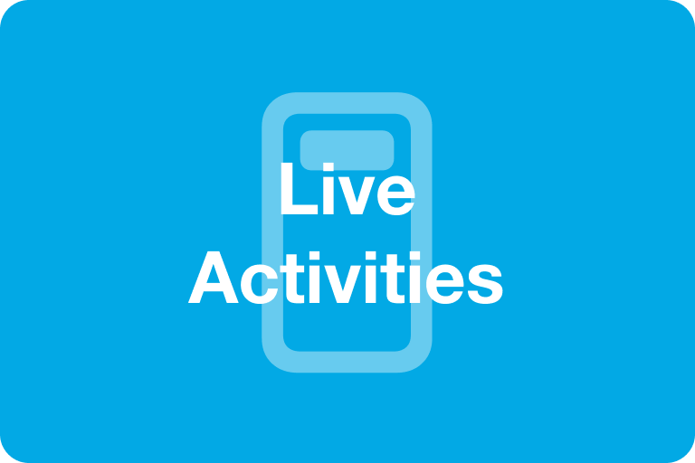 </a> 
<a href="PencilKit"> 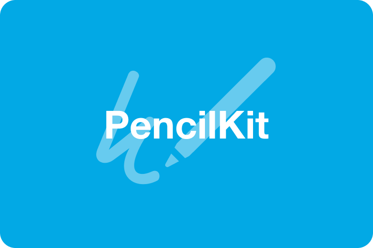 </a> 
<a href="CoreMotion"> 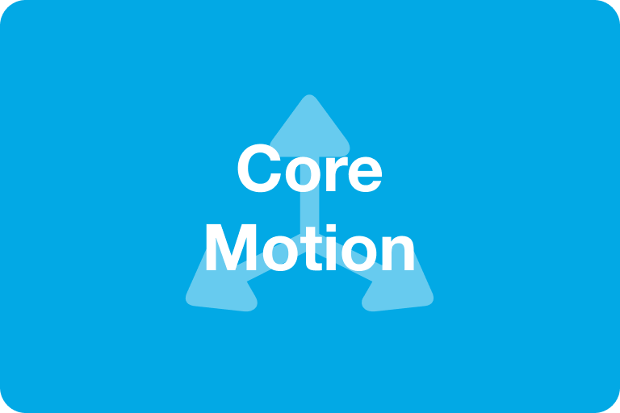 </a> 
<a href="GameKit"> 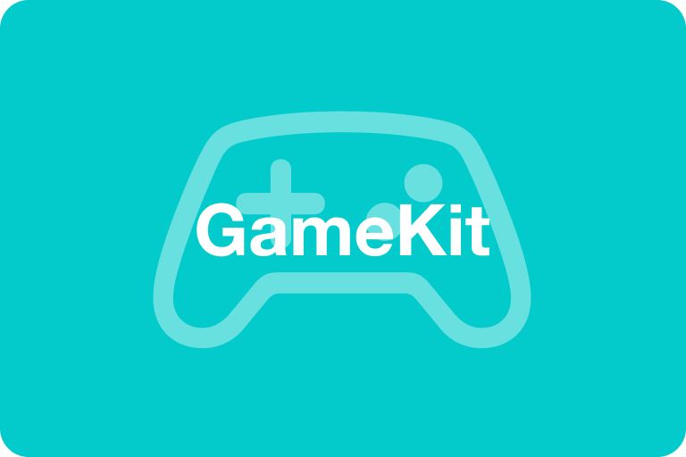 </a> 
<a href="SpriteKit"> 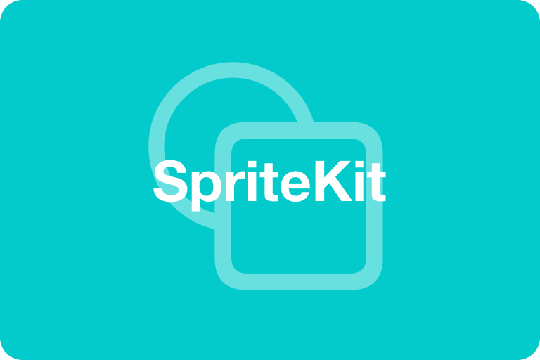 </a> 
 

Apple Developer Academy @ Infinite Learning Batam.
